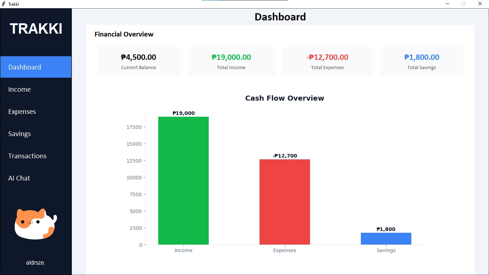
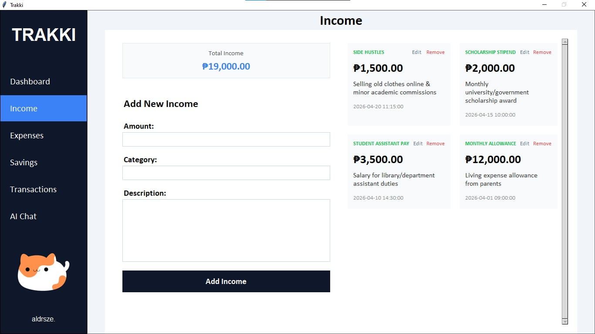
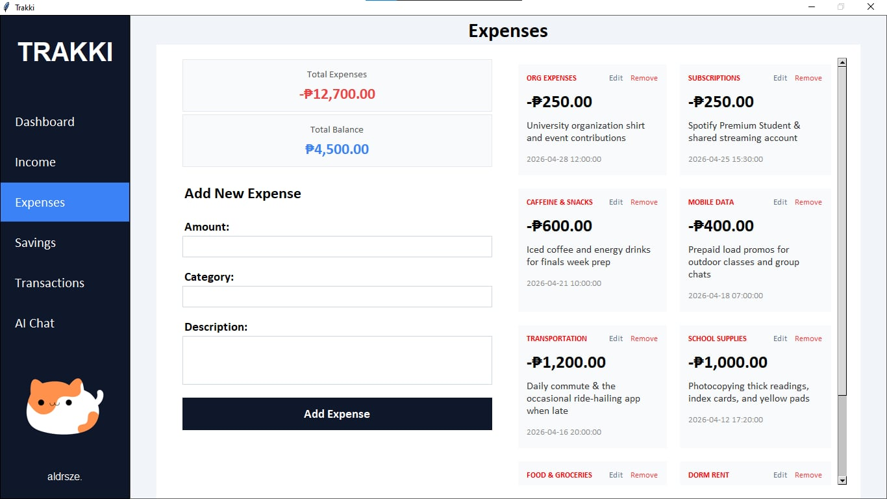
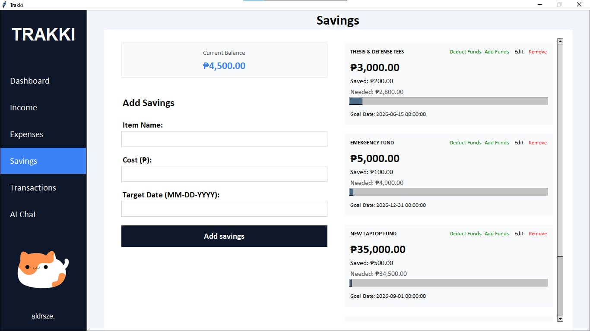
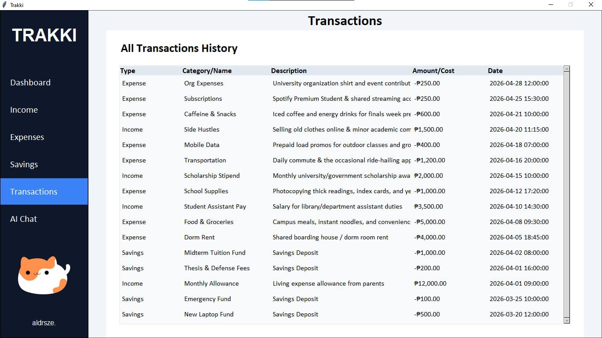
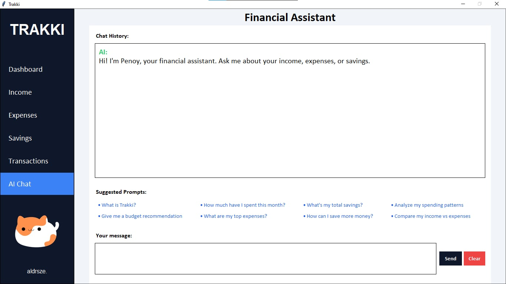

# Trakki - Personal Finance Tracker

Trakki is a Python-based desktop application built with Tkinter that helps you effortlessly track your income, expenses, and savings goals. It also features a built-in AI Financial Coach powered by the Groq API to provide personalized financial insights and advice.

## Features
* **Dashboard & Analytics:** View your current balance, total income, expenses, and savings at a glance with visual charts.
* **Expense & Income Tracking:** Add, edit, and remove transactions to keep your finances up to date.
* **Savings Goals:** Set savings savings goals, track your progress, and manage funds dedicated to specific items.
* **AI Financial Coach:** Chat with a built-in AI assistant that analyzes your current financial data and provides actionable, personalized advice in English and Tagalog.
* **Transaction History:** Review all your past financial activities in a clean table view.

## Screenshots








## Prerequisites
* Python 3.x

## Installation & Setup

1. **Download the Project**
   Extract the project files into a single folder on your computer.

2. **Install Dependencies**
      Open your terminal/command prompt, navigate to the project folder, and run:
      ```bash
         pip install -r requirements.txt
      ```
      or if you are on windows/mac/linux, simply click install_dependencies.bat/install_dependencies.sh

 3. **Run the Application**
    ```bash
    python main.py
    ```
    The AI Coach works out of the box. No configuration needed.

## Tech Stack
* **GUI Framework:** Tkinter
* **Data Visualization:** Matplotlib
* **AI Integration:** Groq API (via the `requests` library)

##  
-Aldrsze.
